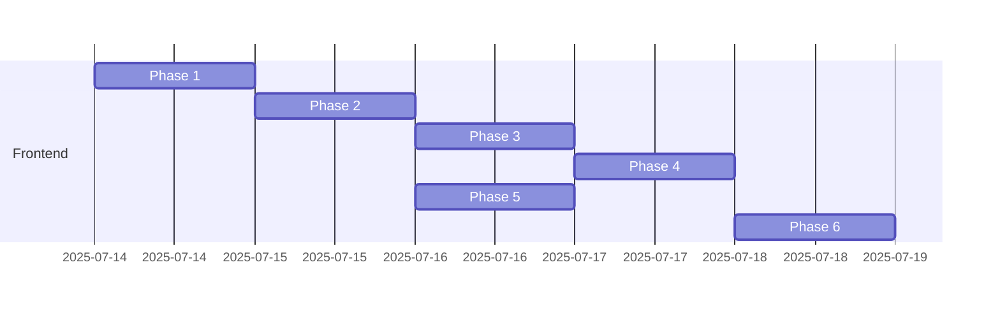

# Comprehensive Architecture Refactor Plan — **v2**

**Author:** Engineering Team  
**Created:** 2025-07-14  
**Duration:** ~4 days (see Gantt below)

## 0 Goals & Success Criteria

1. **Eliminate Critical Bugs** – chat overflow & form-shift issues fixed.
2. **Single-Source Validation** – Zod schemas shared client ⇄ server.
3. **Scalable Component Architecture** – server page → typed client wrapper → atomic components.
4. **Modern Rendering Strategy** – SSR/ISR for static, CSR for interactive flows.
5. **Security & DX** – auto-encrypt middleware, strict linting, accessible UI.
6. **Performance & UX** – mobile-first, minimal animations, Lucide icons.

## 1 Phase-by-Phase Roadmap

| Phase | Title                                 | Time | Owner | Dependencies |
| ----- | ------------------------------------- | ---- | ----- | ------------ |
| 1     | Critical Bug Fixes                    | ½ d  | FE    | –            |
| 2     | Validation Layer Consolidation        | 1 d  | FE    | 1            |
| 3     | Component Architecture Refactor       | 1 d  | FE    | 2            |
| 4     | Rendering & URL-State Strategy        | ½ d  | FE    | 3            |
| 5     | Security Middleware & Input Hardening | ½ d  | FE    | 2            |
| 6     | Styling & Performance Polish          | ½ d  | FE    | 1-5          |

**Legend:** FE = Frontend guild

### Phase 1 — Critical Bug Fixes (½ day)

| ID  | Task                                                         | File(s)                                            |
| --- | ------------------------------------------------------------ | -------------------------------------------------- |
| 1.1 | Chat horizontal scroll → add `break-words` & `overflow-wrap` | `ResumeCompareChat.tsx`                            |
| 1.2 | Form height shift → fixed container, reserved error space    | `ResumeCompareForm.tsx`, `ResumeCompareClient.tsx` |

**Exit Criteria:** No horizontal scroll; form remains static while showing errors.

### Phase 2 — Validation Layer (1 day)

| ID  | Task                                                                | File(s)                                                    |
| --- | ------------------------------------------------------------------- | ---------------------------------------------------------- |
| 2.1 | Create base Zod schemas (`text`, `email`, `date`, `number`, `file`) | `lib/validation/base-schemas.ts`                           |
| 2.2 | Build resume compare schema from base                               | `lib/validation/resume-compare-schema.ts`                  |
| 2.3 | Replace client + server validation with shared schema               | `ResumeCompareForm.tsx`, `resume-compare-server-action.ts` |

**Exit Criteria:** One Zod source; type inference works end-to-end.

### Phase 3 — Component Architecture (1 day)

| ID  | Task                                                                  | Output               |
| --- | --------------------------------------------------------------------- | -------------------- |
| 3.1 | Promote `app/resume-compare/page.tsx` to pure server component        | Server page          |
| 3.2 | Introduce typed client wrapper (`ResumeCompareClient`)                | Client wrapper       |
| 3.3 | Add error & loading boundaries per RFC                                | Boundaries           |

**Exit Criteria:** Client bundle <70 KB; no prop-drilling; strict TypeScript passes.

### Phase 4 — Rendering & URL-State (½ day)

| ID  | Task                                                 | Notes                                           |
| --- | ---------------------------------------------------- | ----------------------------------------------- |
| 4.1 | Install `nuqs` & hydrate URL state                   | Only when state persistence needed              |
| 4.2 | Implement ISR for static pages, SSR for dynamic ones | Next.js 14 `generateStaticParams`, `revalidate` |
| 4.3 | Ensure hydration does not block first paint          | Avoid heavy client JS                           |

### Phase 5 — Security Middleware (½ day)

| ID  | Task                                                 | File(s)             |
| --- | ---------------------------------------------------- | ------------------- |
| 5.1 | Crypto utils – `encrypt`, `decrypt`                  | `lib/crypto.ts`     |
| 5.2 | Edge `middleware.ts` auto-encrypt sensitive payloads | `middleware.ts`     |
| 5.3 | Input sanitisation in base schemas                   | Extend Phase 2 work |

### Phase 6 — Styling & Performance (½ day)

| ID  | Task                                                         | Notes                               |
| --- | ------------------------------------------------------------ | ----------------------------------- |
| 6.1 | Replace heavy Framer Motion blocks with Tailwind transitions | Only where >3 KB win                |
| 6.2 | Swap custom SVGs → Lucide icons                              | memory 2818761                      |
| 6.3 | Audit mobile breakpoints, z-index layering                   | Ensure form overlays chat correctly |

## 2 Quality Gates

1. **CI / Lint:** ESLint, Prettier, TS strict, Husky pre-push.
2. **Unit Tests:** Zod schemas; crypto utils.
3. **Integration Tests:** Form submit, file upload, chat flow (Playwright).
4. **E2E Smoke:** Mobile & desktop responsive checks.
5. **Accessibility:** axe-core passes, keyboard navigation.
6. **Performance:** Lighthouse PWA score ≥ 90.

## 3 Risk Mitigation

| Risk                   | Mitigation                            |
| ---------------------- | ------------------------------------- |
| Breaking API contracts | Incremental PRs; feature flags        |
| Validation regression  | Contract tests on schema change       |
| Deadlines slip         | Daily stand-up; scope locked after P2 |

## 4 Gantt (Days)

## 5 Appendix – ChatGPT-Style UI Lessons

See original appendix in _v1_ for the full bug log and workflow improvements. These lessons have been baked into Phase 6 tasks and Quality Gates.

---

**Approval Required:** Please review scope, timeline, and tasks. Comment or approve to initiate implementation.
